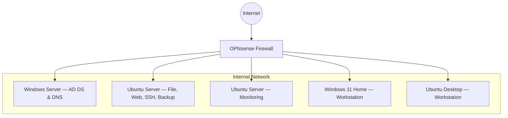

# Virtual-Enterprise-Network
I created this Virtual Enterprise Network to document practical IT experience. 
A self-contained **virtual enterprise IT environment** in VirtualBox:
OPNsense firewall, Windows Server (AD DS), Linux/Windows workstations, file/web/backup servers, and monitoring.

## Topology

## Components
- **Firewall:** OPNsense (NAT/WAN, LAN, DHCP/DNS fwd, rules)
- **Identity:** Windows Server (AD DS, DNS, GPO)
- **Servers:** Ubuntu (Samba/NFS, Apache/Nginx, rsync/cron, SSH), Ubuntu (Monitoring)
- **Workstations:** Windows 11 Home, Ubuntu Desktop

## Learn & Practice
Networking (OPNsense, DNS/DHCP), Windows Server admin (AD/GPO), Linux admin (SSH/Samba/Nginx),
security (least privilege, rules), monitoring (alerts/dashboards), virtualization (VirtualBox).

## Documentation
- [Network Topology](docs/architecture/network-topology.md)
- [Network & IP Plan](docs/architecture/ip-plan.md)
- [Firewall Rules](docs/architecture/firewall-rules.md)
- [Active Directory Design](docs/architecture/ad-design.md)
- [Servers & Services](docs/services/service-catalog.md)
- [Monitoring](docs/operations/monitoring.md)
- [Runbooks](docs/operations/runbooks/index.md)
- [Validation Tests](docs/tests/validation-checklist.md)
- [Architecture Decisions (ADRs)](docs/adr/)

## Status
See [CHANGELOG](CHANGELOG.md) and [Roadmap](docs/roadmap.md).

