# Roadmap
## Toplology

```mermaid
flowchart TB

internet([Internet]); 
wan((WAN)); 
OPN[OPNsense 24.x<br/>FW/NAT/VLANs];
internet --> wan --> OPN;

OPN -- VLAN trunk --> GW_SERVERS;
OPN -- VLAN trunk --> GW_USERS;
OPN -- VLAN trunk --> GW_DMZ;
OPN -- VLAN trunk --> GW_MGMT;
OPN -- VLAN trunk --> GW_GUEST;

subgraph SERVERS["SERVERS VLAN 10.10.10.0/24"];
direction TB;
GW_SERVERS((10.10.10.1));
DC1[DC1<br/>WS2022 Core<br/>AD DS, DNS, KDC, GPO];
DC2[DC2<br/>WS2022 Core<br/>AD DS, DNS secondary];
DHCP[DHCP<br/>WS2022<br/>Scopes and DDNS];
FileSrv[FileSrv<br/>WS2022<br/>SMB, homes, FSRM, DFSN];
PrintSrv[PrintSrv<br/>WS2022<br/>Printer server];
WSUS[WSUS<br/>WS2022<br/>Patching IIS];
CARoot[CA Root offline<br/>WS2022 Core];
CAIssuing[CA Issuing<br/>WS2022<br/>Enterprise CA, CRL AIA];
NPS[NPS<br/>WS2022<br/>RADIUS, 8021X, VPN];
AppSrv[AppSrv<br/>Ubuntu 24.04<br/>Internal apps];
DBSrv[DBSrv<br/>Ubuntu 24.04<br/>MySQL 3306];
Wazuh[Wazuh<br/>Ubuntu 24.04<br/>Manager, Indexer, Dashboard];
BackupSrv[BackupSrv<br/>WS2022<br/>Veeam CE];
GW_SERVERS --> DC1;
GW_SERVERS --> DC2;
GW_SERVERS --> DHCP;
GW_SERVERS --> FileSrv;
GW_SERVERS --> PrintSrv;
GW_SERVERS --> WSUS;
GW_SERVERS --> CAIssuing;
GW_SERVERS --> NPS;
GW_SERVERS --> AppSrv;
GW_SERVERS --> DBSrv;
GW_SERVERS --> Wazuh;
GW_SERVERS --> BackupSrv;
CARoot -. offline .- CAIssuing;
end;

subgraph USERS["USERS VLAN 10.10.20.0/24"];
direction TB;
GW_USERS((10.10.20.1));
WinClient01[WinClient01<br/>Windows 11 Pro 24H2<br/>domain-joined];
UbuClient01[UbuClient01<br/>Ubuntu Desktop 24.04<br/>domain-joined];
GW_USERS --> WinClient01;
GW_USERS --> UbuClient01;
end;

subgraph DMZ["DMZ VLAN 10.10.30.0/24"];
direction TB;
GW_DMZ((10.10.30.1));
Web01[Web01<br/>Ubuntu 24.04<br/>Nginx public site];
GW_DMZ --> Web01;
end;

subgraph MGMT["MGMT VLAN 10.10.40.0/24"];
direction TB;
GW_MGMT((10.10.40.1));
Bastion[Bastion<br/>WS2022<br/>Jump host with RSAT];
OPN_mgmt[OPNsense mgmt IP<br/>10.10.40.1];
GW_MGMT --> Bastion;
GW_MGMT --> OPN_mgmt;
end;

subgraph GUEST["GUEST VLAN 10.10.50.0/24"];
direction TB;
GW_GUEST((10.10.50.1));
GuestWiFi[Guest WiFi / BYOD<br/>Internet-only via NAT<br/>blocked from internal VLANs];
GW_GUEST --> GuestWiFi;
end;

OPN -- "NAT WAN 80/443 to Web01 80/443" --> Web01;
Web01 -. "optional reverse proxy with strict ACLs" .-> AppSrv;

```

### To do (Non-exhaustive)
- Add internal CA and TLS everywhere
- Add SIEM (Wazuh or ELK)
- Automate builds with Ansible/PowerShell;

*Limited by Current Hardware Resources*
